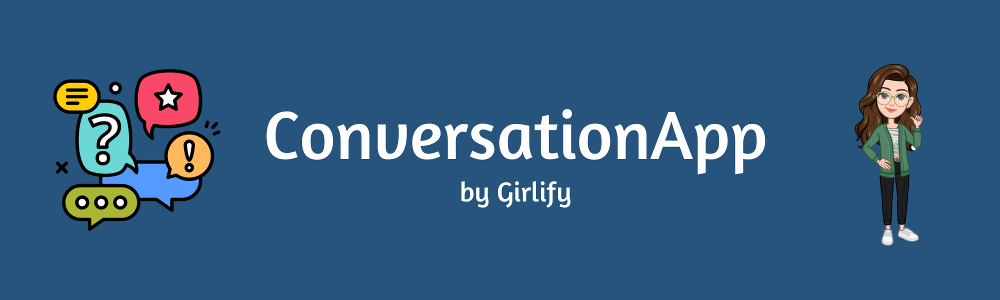
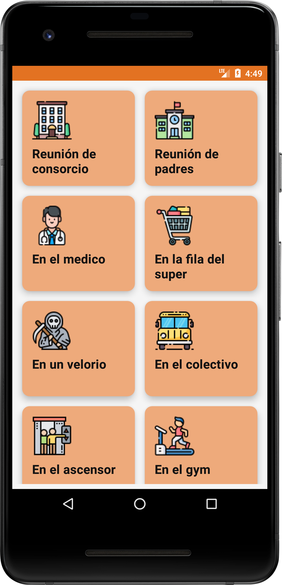
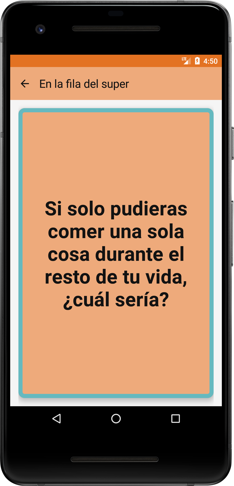

# CONVERSATION APP 🚀

Genera conversaciones interesantes con esta aplicación de preguntas disparadoras.

## Descripción

La aplicación que he desarrollado tiene como finalidad actuar como un generador de diálogos y se
apoya en tecnologías avanzadas para lograrlo. Utiliza Firebase para el almacenamiento en la nube y
Room para el almacenamiento local. Para ofrecer una experiencia interactiva al usuario, se han
integrado animaciones a la dinámica del juego. Las preguntas generadoras de diálogo están
clasificadas en distintas categorías que hacen referencia a situaciones en las que se suelen
producir momentos de silencio incómodos. Además, se ha implementado una arquitectura CLEAN con
Jetpack Compose y se ha utilizado el patrón MVVM. Para mejorar el rendimiento y la eficiencia, se
han utilizado corutinas y Dagger Hilt. La aplicación también cuenta con JUnit y Mock para la
realización de pruebas unitarias y de UI.

## Demo

## Tecnologías utilizadas

- Jetpack Compose
- Clean Architecture
- MVVM
- Room
- Firebase
- Animaciones
- Dagger Hilt
- Corutinas
- Navigation
- JUnit y Mock para testeo unitario y de UI

## Tabla de contenidos

- [Descripción](#descripción)
- [Demo](#demo)
- [Tecnologías utilizadas](#tecnologías-utilizadas)
- [Tabla de contenidos](#tabla-de-contenidos)
- [Instalación](#instalación)
- [Integración continua](#integración-continua)
- [Licencia](#licencia)
- [Footer](#footer)

## Instalación

[(Subir)](#tabla-de-contenidos)

Para instalar y ejecutar la aplicación, es necesario tener Android Studio instalado y seguir los
siguientes pasos:

1. Clonar el repositorio en tu máquina local.
2. Abrir el proyecto en Android Studio.
3. Ejecutar la aplicación en un dispositivo o emulador Android.

## Integración continua

[(Subir)](#tabla-de-contenidos)

Se implementó la integración continua (CI) a través de workflows en GitHub Actions. Se crearon dos
jobs: build y test. El job build se encarga de construir el proyecto y generar un APK para la
distribución. El job test se encarga de ejecutar los test unitarios y de UI. Ambos jobs se ejecutan
en cada push a todas las ramas y el repositorio está configurado para que no permita mergear los
cambios a menos que ambos jobs hayas sido satisfactorios. Los workflows de CI se encuentran en el
archivo ci.yml en el repositorio.

## Licencia

[(Subir)](#tabla-de-contenidos)

Este proyecto está bajo la Licencia GNU GENERAL PUBLIC LICENSE - ver el
archivo [LICENSE](https://github.com/honeybadger2788/ConversationApp/blob/dev/LICENSE) para más
detalles.

## Footer

[(Subir)](#tabla-de-contenidos)

Gracias por llegar hasta aqui! Si quieres hacerme alguna recomendacion o simplemente contactarte
conmigo, puedes hacerlo por cualquiera de estos medios:

- [CV online](https://myporfolio.notion.site/Noelia-Carosella-c0c2f1dbfc8d403e8660356546e90f75)
- [LinkedIn](https://www.linkedin.com/in/noeliabcarosella/)
- [Mail](mailto:noe.carosella@gmail.com)
